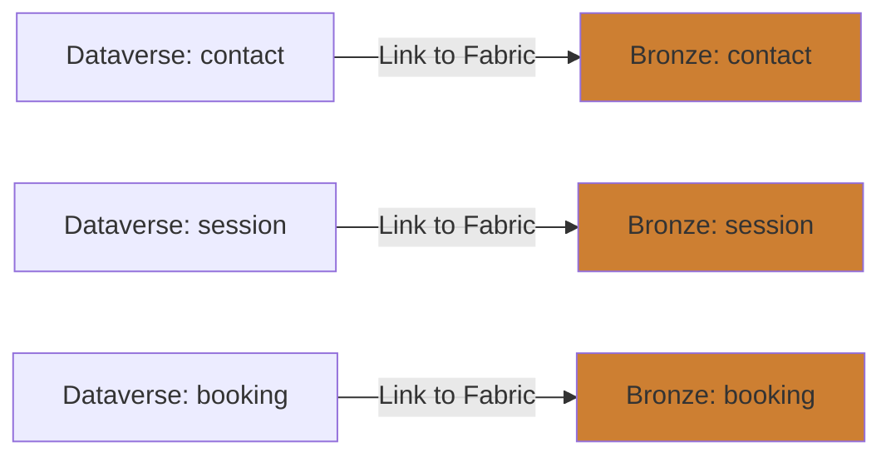
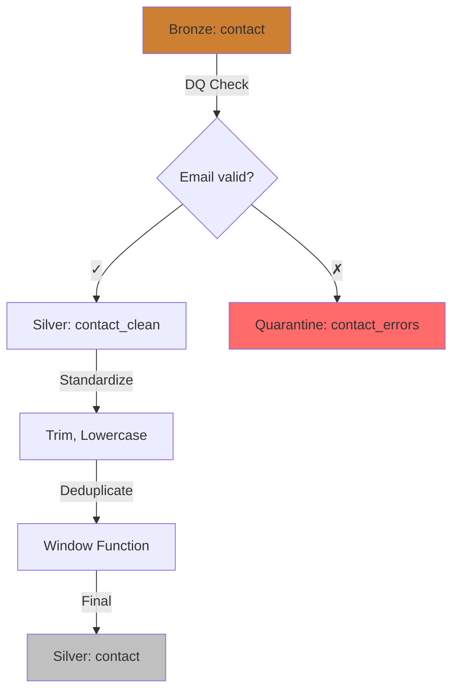
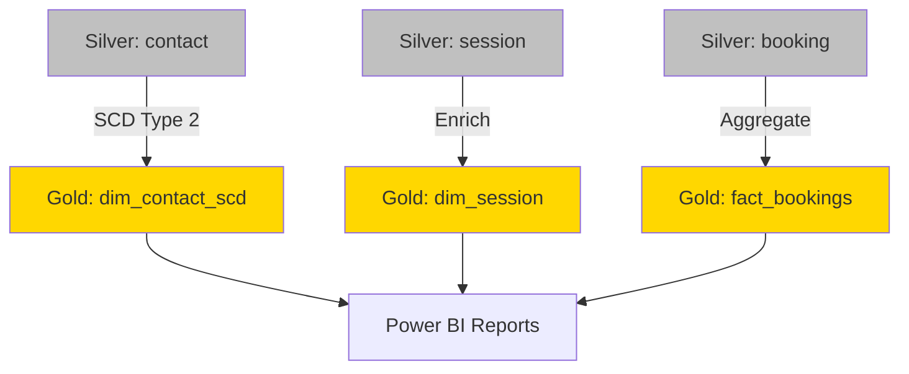
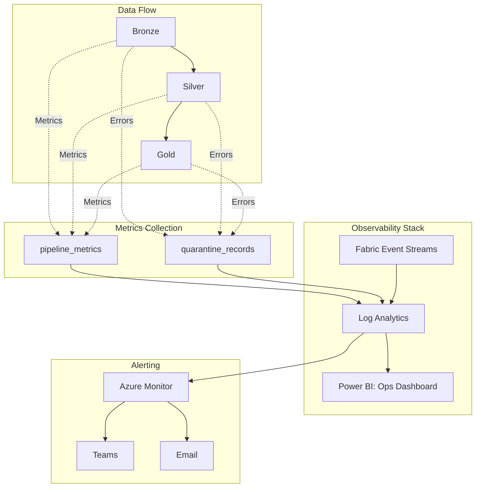
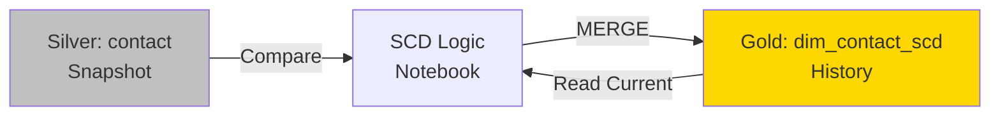
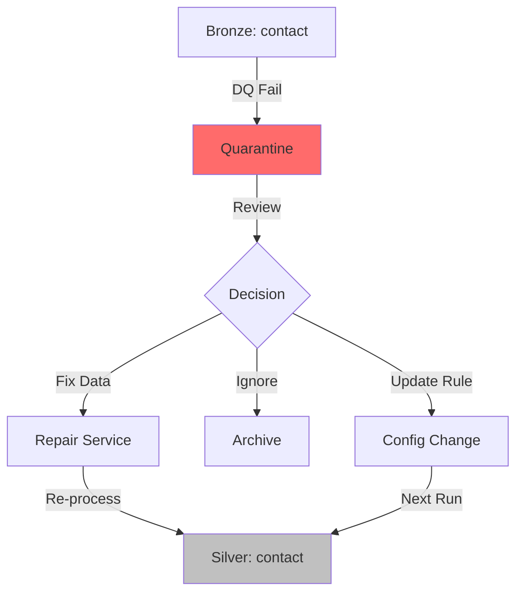

# 🎓 Deep-Dive: Medallion Architecture für Hackerschool

## 1️⃣ Was passiert wo? (Bronze → Silver → Gold)

### Bronze Layer: "Die Wahrheit, wie sie ist"

**Zweck:** 1:1-Kopie von Dataverse, KEINE Transformationen



**Konkret bei Hackerschool:**
- `bronze.contact` = Exakte Kopie von Dataverse `contact`-Tabelle
- **Alle** Felder, auch leere/falsche
- Read-Only (Fabric Link managed das automatisch)
- Delta-Format (Time Travel möglich)

**Was passiert NICHT:**
- ❌ Keine Validierung
- ❌ Keine Deduplizierung
- ❌ Keine Umbenennung
- ❌ Keine Berechnungen

**Beispiel-Row Bronze:**
```json
{
  "contactid": "123-abc",
  "firstname": "  Max  ",           // Whitespace!
  "emailaddress1": "max@@falsch",   // Invalide Email!
  "mobilephone": "017012345",       // Zu kurz!
  "createdon": "2025-10-20T10:00:00Z"
}
```

---

### Silver Layer: "Die bereinigte Wahrheit"

**Zweck:** Data Quality + Standardisierung + Deduplication



**Was passiert in Silver:**

| Transformation | Input (Bronze) | Output (Silver) |
|----------------|----------------|-----------------|
| **Trim Whitespace** | `"  Max  "` | `"Max"` |
| **Lowercase Email** | `"Max@TEST.de"` | `"max@test.de"` |
| **Phone Format** | `"0170 123 456"` | `"+491701234560"` (normalized) |
| **Null → Default** | `NULL` | `"UNKNOWN"` |
| **Deduplicate** | 3x `max@test.de` | 1x (latest by timestamp) |

**Beispiel-Row Silver:**
```json
{
  "contactid": "123-abc",
  "firstname": "Max",                    // Getrimmt
  "emailaddress1": "max@test.de",        // Lowercase + validated
  "mobilephone": "+491701234560",        // Normalisiert
  "createdon": "2025-10-20T10:00:00Z",
  "_dq_score": 100,                      // Custom: Quality Score
  "_silver_loaded_at": "2025-10-22T08:00:00Z"
}
```

**Konkret bei Hackerschool (Silver):**
- `silver.contact` → Bereinigte Kontakte (Schüler, Lehrer, Coaches)
- `silver.session` → Validierte Sessions (Daten konsistent)
- `silver.booking` → Saubere Buchungen (Beträge ≥ 0)

---

### Gold Layer: "Business-ready Analytics"

**Zweck:** Dimensional Modeling + Aggregationen + SCD Type 2



**Was passiert in Gold:**

### A) Dimensional Modeling (Star Schema)

**Dimension Tables:**
- `dim_contact_scd` → Kontakte mit Historie (SCD Type 2)
- `dim_session` → Sessions mit Metadaten
- `dim_partner` → Partner-Dimensionen
- `dim_date` → Datums-Dimension

**Fact Tables:**
- `fact_bookings` → Buchungsfakten (Grain: 1 Booking)
- `fact_session_participation` → Session-Teilnahmen

**Beispiel Star Schema:**
```
fact_bookings
├── booking_sk (PK)
├── contact_sk (FK → dim_contact_scd)
├── session_sk (FK → dim_session)
├── booking_date_sk (FK → dim_date)
├── total_amount
└── booking_status

dim_contact_scd (SCD Type 2)
├── contact_sk (PK, Surrogate Key)
├── contactid (Business Key)
├── firstname, surname, email
├── valid_from, valid_to, is_current
└── hash_value
```

### B) Business Logic Beispiele

**Aggregation: Session-Counts pro Schüler**
```sql
-- In Gold erstellt
CREATE TABLE gold.agg_student_sessions AS
SELECT 
    c.contactid,
    c.firstname,
    c.surname,
    COUNT(DISTINCT sp.sessionid) as total_sessions,
    COUNT(DISTINCT CASE WHEN s.sessionstateid = 'completed' THEN sp.sessionid END) as completed_sessions
FROM silver.contact c
LEFT JOIN silver.session_participant sp ON c.contactid = sp.contactid
LEFT JOIN silver.session s ON sp.sessionid = s.sessionid
GROUP BY c.contactid, c.firstname, c.surname;
```

**Beispiel-Row Gold (Aggregation):**
```json
{
  "contactid": "123-abc",
  "firstname": "Max",
  "surname": "Mustermann",
  "total_sessions": 5,
  "completed_sessions": 3,
  "avg_session_rating": 4.2
}
```

### C) SCD Type 2 (siehe unten bei Frage 5)

---

## 2️⃣ Ganzheitliches Monitoring über alle Stages

### Unified Observability-Architektur



### Unified Metrics Table (über alle Stages)

```sql
CREATE TABLE silver.pipeline_metrics (
    metric_id STRING,
    run_id STRING,
    pipeline_name STRING,
    stage STRING,              -- 'bronze_to_silver', 'silver_to_gold'
    source_table STRING,        -- 'contact', 'session', 'booking'
    target_table STRING,
    
    -- Performance Metrics
    records_read LONG,
    records_written LONG,
    records_failed LONG,
    duration_sec DOUBLE,
    
    -- Quality Metrics
    error_rate DOUBLE,          -- records_failed / records_read
    dq_score_avg DOUBLE,        -- Durchschnittlicher Quality Score
    
    -- SCD Metrics (nur für Gold)
    scd_inserts LONG,
    scd_updates LONG,
    scd_no_changes LONG,
    
    -- Timestamps
    start_time TIMESTAMP,
    end_time TIMESTAMP,
    created_at TIMESTAMP
) USING DELTA;
```

### Beispiel: Metrics für vollständigen Durchlauf

**Run 1: Contact Bronze → Silver**
```json
{
  "run_id": "2025-10-22-001",
  "stage": "bronze_to_silver",
  "source_table": "bronze.contact",
  "target_table": "silver.contact",
  "records_read": 10000,
  "records_written": 9500,
  "records_failed": 500,
  "error_rate": 0.05,
  "duration_sec": 45.2
}
```

**Run 2: Contact Silver → Gold (SCD)**
```json
{
  "run_id": "2025-10-22-001",
  "stage": "silver_to_gold_scd",
  "source_table": "silver.contact",
  "target_table": "gold.dim_contact_scd",
  "records_read": 9500,
  "scd_inserts": 120,
  "scd_updates": 45,
  "scd_no_changes": 9335,
  "duration_sec": 78.5
}
```

### Power BI Dashboard: End-to-End View

**Query für Cross-Stage-Monitoring:**
```sql
-- Zeige mir alle Runs heute mit Error Rate
SELECT 
    DATE(start_time) as run_date,
    stage,
    source_table,
    SUM(records_read) as total_records,
    SUM(records_failed) as total_errors,
    AVG(error_rate) as avg_error_rate,
    AVG(duration_sec) as avg_duration
FROM silver.pipeline_metrics
WHERE start_time >= CURRENT_DATE()
GROUP BY DATE(start_time), stage, source_table
ORDER BY avg_error_rate DESC;
```

**Dashboard-Visualisierungen:**
1. **Funnel-Chart:** Records durch Pipeline (Bronze → Silver → Gold)
2. **Error-Rate-Timeline:** Trend über Zeit pro Stage
3. **Duration-Heatmap:** Welche Tables/Stages sind Bottlenecks?
4. **SCD-Activity:** Wie viele Changes pro Tag?

---

## 3️⃣ Dynamisch neue Tables hinzufügen

### Config-Driven: 3 Schritte

#### Schritt 1: Config-Eintrag

```sql
-- Neue Table: account (Partner)
INSERT INTO silver.transformation_config VALUES (
    'account_bronze_silver',
    'bronze.account',
    'silver',
    'dq_check',
    '{
        "validations": [
            {"field": "name", "type": "not_null"},
            {"field": "hs_partner_level", "type": "enum", "values": ["Bronze", "Silver", "Gold"]}
        ]
    }',
    10,  -- Priority
    true,
    current_timestamp()
);

-- SCD Config für Gold
INSERT INTO silver.transformation_config VALUES (
    'account_silver_gold_scd',
    'silver.account',
    'gold',
    'scd2',
    '{
        "business_key": "accountid",
        "tracked_columns": ["hs_partner_level", "name"],
        "target_table": "gold.dim_account_scd"
    }',
    20,
    true,
    current_timestamp()
);
```

#### Schritt 2: Pipeline Auto-Discovery

**Notebook: `dynamic_table_processor.py`**
```python
# Liest Config-Table
configs = spark.read.table("silver.transformation_config") \
    .filter("active = true") \
    .orderBy("priority")

# ForEach über Tables
for row in configs.collect():
    source_table = row['source_table']
    rule_type = row['rule_type']
    rule_def = json.loads(row['rule_definition'])
    
    if rule_type == 'dq_check':
        process_dq_checks(source_table, rule_def)
    elif rule_type == 'scd2':
        process_scd2(source_table, rule_def)
```

#### Schritt 3: ZERO Code-Changes!

**Das war's!** Keine Pipeline-Anpassung nötig → Config-Entry reicht.

### Self-Service für Business-User

**Scenario:** Daten-Team will neue Dataverse-Table `hs_course_feedback` hinzufügen

1. **Check:** Ist Bronze-Link aktiv? (Dataverse Link to Fabric)
2. **Config:** INSERT in `transformation_config` via SQL Notebook
3. **Run:** Pipeline läuft automatisch beim nächsten Schedule

**Governance:**
- Approval-Workflow: Config-Changes = PR in Git
- Validation: Schema-Check vor Pipeline-Run
- Rollback: Deaktiviere Config-Entry (`active = false`)

---

## 4️⃣ Super-schnelle Implementierung: Tooling-Optionen

### Option A: Fabric REST API + CLI (Empfehlung für Dev-Speed)

**Setup-Zeit: ~2 Stunden**

```bash
# 1. Fabric CLI installieren
pip install azure-cli azure-cli-ml

# 2. Login
az login

# 3. Lakehouse erstellen (per Script)
az fabric lakehouse create \
    --workspace "hs-fabric-dev" \
    --name "hs_bronze_dev"

# 4. Notebooks deployen
az fabric notebook create \
    --workspace "hs-fabric-dev" \
    --name "bronze_to_silver" \
    --file "./notebooks/bronze_to_silver.py"

# 5. Pipeline deployen
az fabric pipeline create \
    --workspace "hs-fabric-dev" \
    --definition-file "./pipelines/medallion_master.json"
```

**Pros:**
- ✅ Schnell iterierbar (Git → Deploy in 30 Sek)
- ✅ Versionierbar (alles in Git)
- ✅ CI/CD-ready (GitHub Actions)

**Cons:**
- ❌ Initial Setup-Learning Curve
- ❌ Fabric CLI noch Preview (kann instabil sein)

---

### Option B: Claude Code (Agentic Deployment)

**Wie es funktioniert:**

1. **Setup Repo:**
```bash
git clone https://github.com/hackerschool/fabric-medallion
cd fabric-medallion
```

2. **Claude Code Prompt:**
```
@claude-code 
Implementiere Medallion-Pipeline in Fabric:
- 3 Lakehouses: bronze/silver/gold
- Notebooks: bronze_to_silver.py, silver_to_gold_scd.py
- Pipeline: orchestration.json
- Config: transformation_config.sql seed data
Deploy alles in Workspace "hs-fabric-dev"
```

3. **Claude Code macht:**
- ✅ Erstellt alle Files strukturiert
- ✅ Nutzt Fabric REST API für Deployment
- ✅ Testet Notebooks lokal (falls Mock-Data vorhanden)
- ✅ Gibt dir fertige URLs zu Fabric-Ressourcen

**Pros:**
- ✅ **ULTRA-SCHNELL** (~15 Min für Full Stack)
- ✅ Best Practices aus Training-Data
- ✅ Auto-Dokumentation

**Cons:**
- ❌ Braucht Fabric API Access Token
- ❌ Weniger Kontrolle über Details

---

### Option C: Fabric UI + Git Sync (Balance)

**Workflow:**

1. **In Fabric UI:**
   - Workspace erstellen: `hs-fabric-dev`
   - 3 Lakehouses: bronze/silver/gold (manuell klicken)
   
2. **Git Integration aktivieren:**
   - Workspace Settings → Git Integration
   - Repo: `github.com/hackerschool/fabric-medallion`
   - Branch: `develop`

3. **Notebooks in VS Code schreiben:**
   - Lokales Development
   - Git Push → Auto-Sync zu Fabric

**Pros:**
- ✅ Visual + Code kombiniert
- ✅ Fabric-nativer Workflow
- ✅ Easy Debugging in UI

**Cons:**
- ❌ Initial Setup: 30 Min
- ❌ Git-Sync manchmal verzögert

---

### 🏆 Meine Empfehlung für Hackerschool:

**Phase 1 (Jetzt - Dev):** Option C (Fabric UI + Git)
- Grund: Team lernt Fabric-UI kennen, Git als Safety-Net

**Phase 2 (Nach 2 Wochen - Test/Prod):** Option A (CLI + CI/CD)
- Grund: Automated Deployments, Zero-Touch

**Phase 3 (Future):** Claude Code für neue Features
- Grund: Speed für neue Transformationen

---

## 5️⃣ SCD Type 2: Wo & Wie genau?

### Wo passiert SCD?

**Stage:** Silver → Gold



**Timing:** Täglich (Batch) oder nach jedem Silver-Update

---

### Wie funktioniert SCD Type 2 technisch?

#### Schritt-für-Schritt am Beispiel Contact

**Ausgangslage (Tag 1):**
```sql
-- Gold: dim_contact_scd (leer)
-- Silver: contact hat 1 Row
contactid=123, email=max@alt.de
```

**Run 1 (Initial Load):**
```sql
-- INSERT: Neue Row in Gold
contact_sk=1, contactid=123, email=max@alt.de, 
valid_from=2025-10-01, valid_to=9999-12-31, is_current=True
```

---

**Tag 30: Email ändert sich in Silver**
```sql
-- Silver: contact
contactid=123, email=max@neu.de  -- CHANGED!
```

**Run 2 (SCD Logic):**

**1. Hash-Vergleich:**
```python
# Silver
new_hash = md5("max@neu.de")  # aa123...

# Gold (current)
old_hash = md5("max@alt.de")   # bb456...

# → CHANGED!
```

**2. MERGE Statement:**
```sql
MERGE INTO gold.dim_contact_scd AS target
USING (
    SELECT 
        contactid,
        emailaddress1,
        MD5(emailaddress1) as hash_value,
        CURRENT_TIMESTAMP() as valid_from
    FROM silver.contact
) AS source
ON target.contactid = source.contactid 
   AND target.is_current = TRUE

WHEN MATCHED AND target.hash_value != source.hash_value THEN
    UPDATE SET 
        is_current = FALSE,
        valid_to = CURRENT_TIMESTAMP()  -- Schließe alte Row

WHEN NOT MATCHED THEN
    INSERT (...)  -- Neue Row mit neuem Hash
```

**3. Resultat in Gold:**
```
Row 1: sk=1, contactid=123, email=max@alt.de, 
       valid_from=2025-10-01, valid_to=2025-10-30, is_current=False  ← UPDATED

Row 2: sk=2, contactid=123, email=max@neu.de, 
       valid_from=2025-10-30, valid_to=9999-12-31, is_current=True   ← INSERTED
```

---

### Delta Lake MERGE erklärt (siehe Frage 7)

---

## 6️⃣ Mit Quarantäne-Daten weiterarbeiten

### Quarantine-Lifecycle



### Use Cases

#### A) **Data Repair Service**

**Scenario:** 500 Contacts haben invalide Email (z.B. `max@@test.de`)

```sql
-- 1. Quarantine abfragen
SELECT * FROM silver.quarantine_records
WHERE error_type = 'email_invalid'
  AND created_at >= '2025-10-20';

-- 2. Bulk-Fix vorbereiten
CREATE TEMP VIEW repaired_contacts AS
SELECT 
    JSON_EXTRACT(raw_record, '$.contactid') as contactid,
    REGEXP_REPLACE(
        JSON_EXTRACT(raw_record, '$.emailaddress1'), 
        '@@', '@'
    ) as fixed_email  -- Fix: @@ → @
FROM silver.quarantine_records
WHERE error_type = 'email_invalid';

-- 3. Re-Process: Insert in Silver
INSERT INTO silver.contact
SELECT * FROM repaired_contacts
WHERE fixed_email RLIKE '^[a-zA-Z0-9._%+-]+@[a-zA-Z0-9.-]+\.[a-zA-Z]{2,}$';
```

---

#### B) **Rule Refinement**

**Scenario:** Quarantine zeigt: Viele deutsche Handynummern ohne +49

```sql
-- Analyse
SELECT 
    error_message,
    COUNT(*) as error_count
FROM silver.quarantine_records
WHERE error_type = 'phone_invalid'
GROUP BY error_message
ORDER BY error_count DESC;

-- Result:
-- "Phone must start with +49 or 0" → 2000 Rows

-- Fix: Config-Update
UPDATE silver.transformation_config
SET rule_definition = '{
    "field": "mobilephone",
    "validation": "regex",
    "pattern": "^(\\+49|0)[1-9]\\d{8,14}$",
    "auto_prefix": "+49"  -- NEW: Add prefix if missing
}'
WHERE config_id = 'contact_phone_dq';
```

---

#### C) **False Positive Handling**

**Scenario:** Einige "invalide" Emails sind eigentlich OK (z.B. `name+tag@example.com`)

```sql
-- Whitelist erstellen
CREATE TABLE silver.dq_whitelist (
    rule_type STRING,
    pattern STRING,
    reason STRING
);

INSERT INTO silver.dq_whitelist VALUES
('email_invalid', '%+%@%.%', 'Plus-addressing is valid');

-- DQ-Check Update: Exclude Whitelist
-- (in Notebook-Code)
```

---

#### D) **Quarantine-Dashboard für Business-User**

**Power BI Report:**
- **Top Error Types** (Pie Chart)
- **Error Trend** (Line über Zeit)
- **Sample Records** (Table mit Top 10 Fehler)
- **Action Buttons:** "Mark as Fixed", "Update Rule"

---

## 7️⃣ Delta MERGE: Die Magic erklärt

### Was ist Delta MERGE?

**Einfach:** SQL UPDATE + INSERT in EINER Operation

**Standard-SQL (2 Statements):**
```sql
-- 1. Update bestehende Rows
UPDATE gold.dim_contact_scd
SET is_current = FALSE, valid_to = NOW()
WHERE contactid = '123' AND is_current = TRUE;

-- 2. Insert neue Row
INSERT INTO gold.dim_contact_scd
VALUES (2, '123', 'max@neu.de', NOW(), '9999-12-31', TRUE);
```

**Delta MERGE (1 Statement):**
```sql
MERGE INTO gold.dim_contact_scd AS target
USING silver.contact AS source
ON target.contactid = source.contactid AND target.is_current = TRUE

WHEN MATCHED AND changed THEN UPDATE ...
WHEN NOT MATCHED THEN INSERT ...
```

---

### Warum ist MERGE besser?

| Feature | Standard SQL | Delta MERGE |
|---------|-------------|-------------|
| **Atomicity** | ❌ 2 Statements = Race Condition | ✅ 1 Transaction |
| **Performance** | ❌ 2x Table Scan | ✅ 1x Table Scan |
| **Complex Logic** | ❌ Viel Code | ✅ Deklarativ |
| **Time Travel** | ❌ Nein | ✅ Ja (Delta-Feature) |

---

### MERGE für SCD Type 2 (Complete Example)

```sql
MERGE INTO gold.dim_contact_scd AS target
USING (
    -- Source: Silver mit Hash
    SELECT 
        contactid,
        firstname,
        surname,
        emailaddress1,
        mobilephone,
        MD5(CONCAT(emailaddress1, mobilephone)) as hash_value,
        CURRENT_TIMESTAMP() as valid_from,
        CAST('9999-12-31' AS TIMESTAMP) as valid_to,
        TRUE as is_current
    FROM silver.contact
) AS source
ON target.contactid = source.contactid 
   AND target.is_current = TRUE

-- Fall 1: Row existiert UND hat sich geändert
WHEN MATCHED AND target.hash_value != source.hash_value THEN
    UPDATE SET 
        is_current = FALSE,
        valid_to = source.valid_from  -- Schließe alte Version

-- Fall 2: Neue Row (contactid nicht in Gold)
WHEN NOT MATCHED THEN
    INSERT (
        contact_sk,
        contactid,
        firstname,
        surname,
        emailaddress1,
        mobilephone,
        valid_from,
        valid_to,
        is_current,
        hash_value
    ) VALUES (
        -- Surrogate Key auto-generiert via IDENTITY
        NULL,
        source.contactid,
        source.firstname,
        source.surname,
        source.emailaddress1,
        source.mobilephone,
        source.valid_from,
        source.valid_to,
        source.is_current,
        source.hash_value
    );

-- NACH MERGE: Insert neue Version für geänderte Rows
INSERT INTO gold.dim_contact_scd
SELECT 
    NULL as contact_sk,  -- Auto-generated
    source.*
FROM (
    SELECT * FROM silver.contact
) source
INNER JOIN (
    -- Finde Rows die gerade auf is_current=FALSE gesetzt wurden
    SELECT DISTINCT contactid 
    FROM gold.dim_contact_scd
    WHERE valid_to = CURRENT_TIMESTAMP()
      AND is_current = FALSE
) changed
ON source.contactid = changed.contactid;
```

---

### MERGE Internals (Advanced)

**Delta Lake File-Level:**
```
gold/dim_contact_scd/
├── _delta_log/
│   ├── 00000.json  (Initial)
│   ├── 00001.json  (MERGE Metadata)
│   └── 00002.json  (MERGE Metadata)
├── part-00000.parquet  (Original Data)
├── part-00001.parquet  (MERGE: Updated Rows)
└── part-00002.parquet  (MERGE: New Inserts)
```

**MERGE = 3 Operationen:**
1. **Read:** Scan Target + Source
2. **Update:** Modify matched rows (new Parquet file)
3. **Insert:** Add unmatched rows (new Parquet file)

**Delta Log Entry:**
```json
{
  "commitInfo": {
    "operation": "MERGE",
    "operationMetrics": {
      "numTargetRowsInserted": 120,
      "numTargetRowsUpdated": 45,
      "numTargetRowsDeleted": 0
    }
  }
}
```

**Time Travel:**
```sql
-- Vor MERGE
SELECT * FROM gold.dim_contact_scd VERSION AS OF 1;

-- Nach MERGE
SELECT * FROM gold.dim_contact_scd VERSION AS OF 2;
```

---

## 🎯 Zusammenfassung: Deine 7 Fragen beantwortet

| Frage | Antwort in 1 Satz |
|-------|-------------------|
| **1. Was passiert wo?** | Bronze = Raw 1:1, Silver = Clean + DQ, Gold = Analytics + SCD |
| **2. Ganzheitlich monitoren?** | Unified `pipeline_metrics` Table + Log Analytics + Power BI Dashboard |
| **3. Dynamisch neue Tables?** | Config-Entry in `transformation_config` → Pipeline auto-discovert |
| **4. Schnelle Implementierung?** | Fabric UI + Git Sync (Dev), dann CLI + CI/CD (Prod) |
| **5. Wo/wie SCD?** | Silver → Gold, Delta MERGE mit Hash-Comparison |
| **6. Quarantäne weiterarbeiten?** | Repair-Service + Rule-Updates + Re-Process |
| **7. Delta MERGE?** | Atomic UPDATE+INSERT in 1 Transaktion mit Time Travel |

---

## 🚀 Ready für Implementation?

Möchtest du jetzt:

**A)** Code-Beispiele sehen? (Notebook für Bronze→Silver mit DQ, SCD-Notebook, Pipeline JSON)

**B)** Noch ein Detail vertiefen? (z.B. "Wie teste ich die Pipeline lokal?")

**C)** Direkt starten mit Implementation-Guide? (Step-by-Step für ersten Table-Flow)
