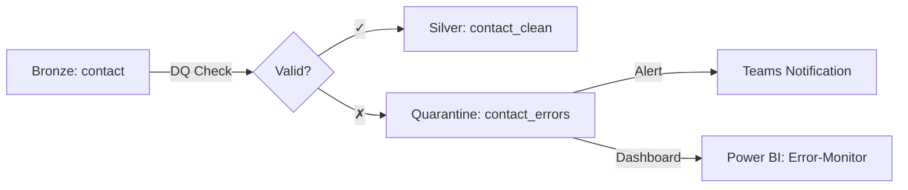
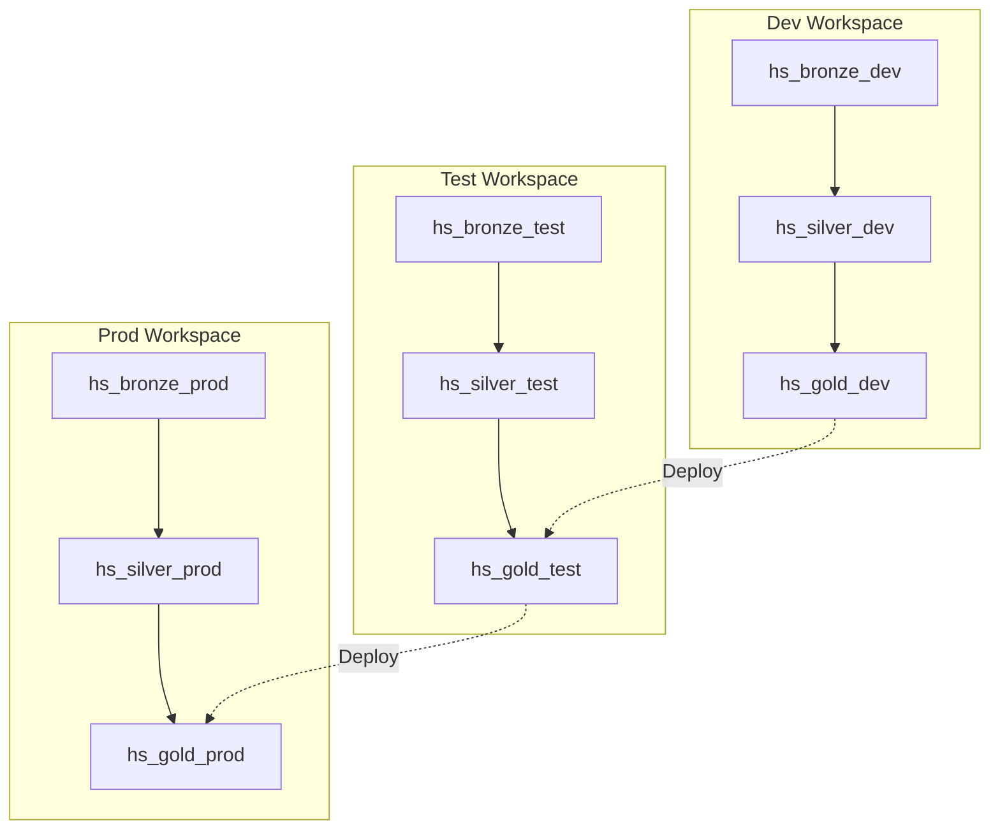

## Executive Summary
**Config-driven Ansatz** mit JSON-Rules in Delta Tables + **Delta Lake MERGE für SCD Type 2** + **Event Streams für Observability**. Keine Custom Python-Functions nötig → einfache Wartung. Dev-first, später skalierbar auf Test/Prod.

---

## 1️⃣ DQ Checks & Konsistenz – Konkret für Hackerschool

### Regeltypen basierend auf eurem Datenmodell

| Entity | DQ Check | Regel | Beispiel |
|--------|----------|-------|----------|
| **contact** | Email-Format | Regex: `^[a-zA-Z0-9._%+-]+@[a-zA-Z0-9.-]+\.[a-zA-Z]{2,}$` | `max@hackerschool.de` ✓ |
| **contact** | Telefon DE | Regex: `^(\+49\|0)[1-9]\d{8,14}$` | `+4917012345678` ✓ |
| **contact** | Pflichtfelder | `firstname`, `surname` NOT NULL | Reject wenn fehlt |
| **session** | Session-Dates | `starttime < endtime` | Logik-Check |
| **booking** | Booking-Amount | `total >= 0` | Negative Beträge → Quarantine |
| **account** | Partner-Level | `hs_partner_level IN ('Bronze','Silver','Gold')` | Enum-Validierung |

### Config-Table-Schema (einfach!)

```sql
CREATE TABLE silver.transformation_config (
    config_id STRING,
    source_table STRING,
    target_layer STRING,  -- 'silver' oder 'gold'
    rule_type STRING,     -- 'dq_check', 'scd2', 'aggregate'
    rule_definition STRING, -- JSON mit Regel-Details
    priority INT,
    active BOOLEAN,
    created_at TIMESTAMP
) USING DELTA;
```

**Beispiel-Config für Contact Email-Check:**
```json
{
  "config_id": "contact_email_dq",
  "source_table": "bronze.contact",
  "target_layer": "silver",
  "rule_type": "dq_check",
  "rule_definition": {
    "field": "emailaddress1",
    "validation": "regex",
    "pattern": "^[a-zA-Z0-9._%+-]+@[a-zA-Z0-9.-]+\\.[a-zA-Z]{2,}$",
    "error_action": "quarantine"
  },
  "priority": 1,
  "active": true
}
```

---

## 2️⃣ SCD Type 2 – Konkrete Hackerschool Use Cases

### Use Case 1: Contact-History (Email/Phone-Änderungen)

**Business Value:** Analytics kann auswerten:
- "Wie viele Schüler haben ihre Kontaktdaten in Q3 aktualisiert?"
- "Bounce-Rate bei alten vs. neuen Email-Adressen"

**Tracked Attributes:** `emailaddress1`, `mobilephone`, `firstname`, `surname`

**SCD Schema:**
```sql
CREATE TABLE gold.dim_contact_scd (
    contact_sk BIGINT GENERATED ALWAYS AS IDENTITY,  -- Surrogate Key
    contactid STRING,                                 -- Business Key
    firstname STRING,
    surname STRING,
    emailaddress1 STRING,
    mobilephone STRING,
    valid_from TIMESTAMP,
    valid_to TIMESTAMP,
    is_current BOOLEAN,
    hash_value STRING  -- MD5 über tracked attributes
) USING DELTA;
```

**Beispiel-Szenario:**
```
Tag 1: Max Mustermann, max@alt.de
Tag 30: Max Mustermann, max@neu.de

Resultat in gold.dim_contact_scd:
Row 1: contactid=123, email=max@alt.de, valid_from=2025-01-01, valid_to=2025-01-30, is_current=False
Row 2: contactid=123, email=max@neu.de, valid_from=2025-01-30, valid_to=9999-12-31, is_current=True
```

### Use Case 2: Session-Status-Historie

**Business Value:** "Conversion-Funnel: Von geplant → durchgeführt → abgesagt"

**Tracked:** `sessionstateid` (von session.sessionstate)

**Analytics-Query:**
```sql
-- Wie viele Sessions wurden in Q3 von 'planned' auf 'cancelled' geändert?
SELECT 
    COUNT(*) as cancelled_count
FROM gold.dim_session_scd
WHERE sessionstateid_name = 'cancelled'
  AND valid_from BETWEEN '2025-07-01' AND '2025-09-30';
```

### Use Case 3: Partner-Level-Changes

**Business Value:** "Welche Partner wurden hochgestuft? → Sponsoring-Reports"

**Tracked:** `account.hs_partner_level`

---

## 3️⃣ Error Management – Quarantine-Pattern

### Architektur



### Quarantine-Schema

```sql
CREATE TABLE silver.quarantine_records (
    quarantine_id STRING,
    source_table STRING,
    error_type STRING,  -- 'email_invalid', 'phone_invalid', 'null_constraint'
    error_message STRING,
    raw_record STRING,  -- JSON des fehlerhaften Records
    pipeline_run_id STRING,
    created_at TIMESTAMP
) USING DELTA;
```

### Auto-Retry-Logik

| Error Type | Retry? | Max Retries |
|-----------|--------|-------------|
| `email_invalid` | ❌ No | - |
| `network_timeout` | ✅ Yes | 3 |
| `null_constraint` | ❌ No | - |

---

## 4️⃣ Observability – 3-Tier-Stack

### Tier 1: Pipeline-Level (Fabric Event Streams)

**Auto-collected Events:**
- Pipeline Start/End
- Notebook Execution Duration
- Activity Failures

**Integration:**
```
Fabric Event Streams → Azure Log Analytics Workspace
```

### Tier 2: Custom Metrics (In-Notebook)

**Zu erfassende Metriken:**

| Metric | Beschreibung | Target |
|--------|--------------|--------|
| `records_processed` | Anzahl verarbeiteter Rows | Per Table |
| `records_failed` | Anzahl Fehler | < 5% von total |
| `transformation_duration_sec` | Laufzeit | < 300 sec |
| `scd2_updates` | Anzahl historisierter Changes | Info |

**Metrics-Table:**
```sql
CREATE TABLE silver.pipeline_metrics (
    run_id STRING,
    pipeline_name STRING,
    source_table STRING,
    records_processed LONG,
    records_failed LONG,
    error_rate DOUBLE,
    duration_sec DOUBLE,
    timestamp TIMESTAMP
) USING DELTA;
```

### Tier 3: Alerting (Azure Monitor)

**Alert-Rules:**

```yaml
alert_rules:
  - name: "High Error Rate"
    condition: "error_rate > 0.05"
    action: "Send Teams Notification"
    
  - name: "Pipeline Failure"
    condition: "pipeline_status = 'Failed'"
    action: "Email to stefan.kochems@ey.com"
    
  - name: "Long Running Pipeline"
    condition: "duration_sec > 7200"
    action: "Teams Warning"
```

---

## 5️⃣ CI/CD für Dev/Test/Prod

### Workspace-Strategie



### Git Integration

**Repository-Struktur:**
```
hackerschool-fabric/
├── notebooks/
│   ├── bronze_to_silver.py
│   ├── silver_to_gold.py
│   └── scd2_contact.py
├── pipelines/
│   └── medallion_master_pipeline.json
├── config/
│   ├── dev.json
│   ├── test.json
│   └── prod.json
└── sql/
    └── transformation_config_seed.sql
```

**Parameter-Files:**

`config/dev.json`:
```json
{
  "bronze_lakehouse": "hs_bronze_dev",
  "silver_lakehouse": "hs_silver_dev",
  "gold_lakehouse": "hs_gold_dev",
  "alert_threshold_error_rate": 0.1,
  "batch_size": 1000,
  "enable_scd2": true
}
```

`config/prod.json`:
```json
{
  "bronze_lakehouse": "hs_bronze_prod",
  "silver_lakehouse": "hs_silver_prod",
  "gold_lakehouse": "hs_gold_prod",
  "alert_threshold_error_rate": 0.02,
  "batch_size": 5000,
  "enable_scd2": true
}
```

---

## 🚀 Nächste Schritte

**Möchtest du, dass ich dir konkrete Code-Beispiele erstelle für:**

1. ✅ **Notebook: Bronze → Silver mit DQ-Checks** (Config-driven, ~100 Zeilen)
2. ✅ **Notebook: SCD Type 2 für Contact-Entity** (Delta MERGE-Pattern, ~80 Zeilen)
3. ✅ **SQL: transformation_config Seed-Data** (Beispiel-Regeln für Hackerschool)
4. ✅ **Pipeline JSON: Orchestrierung** (ForEach über Config-Table)
5. ✅ **Power BI: Observability Dashboard** (Queries für Metrics)

**Oder soll ich erstmal ein spezifisches Detail vertiefen?** (z.B. "Wie genau funktioniert Delta MERGE intern?" oder "Alternative Error-Handling-Patterns")
