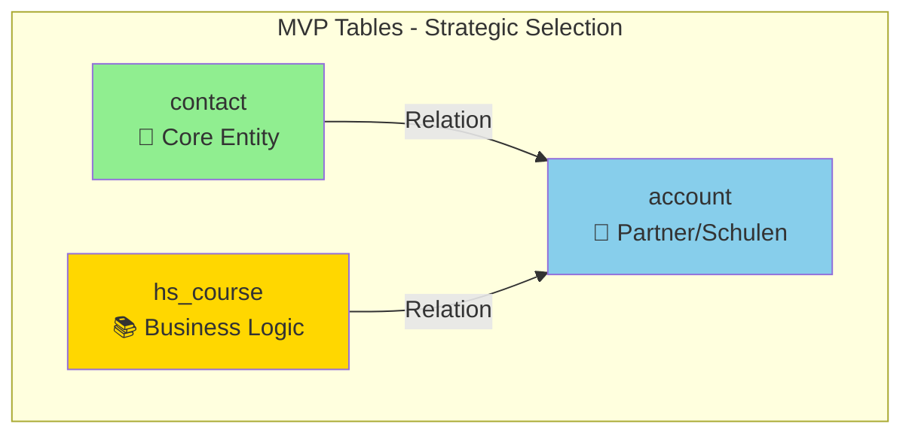
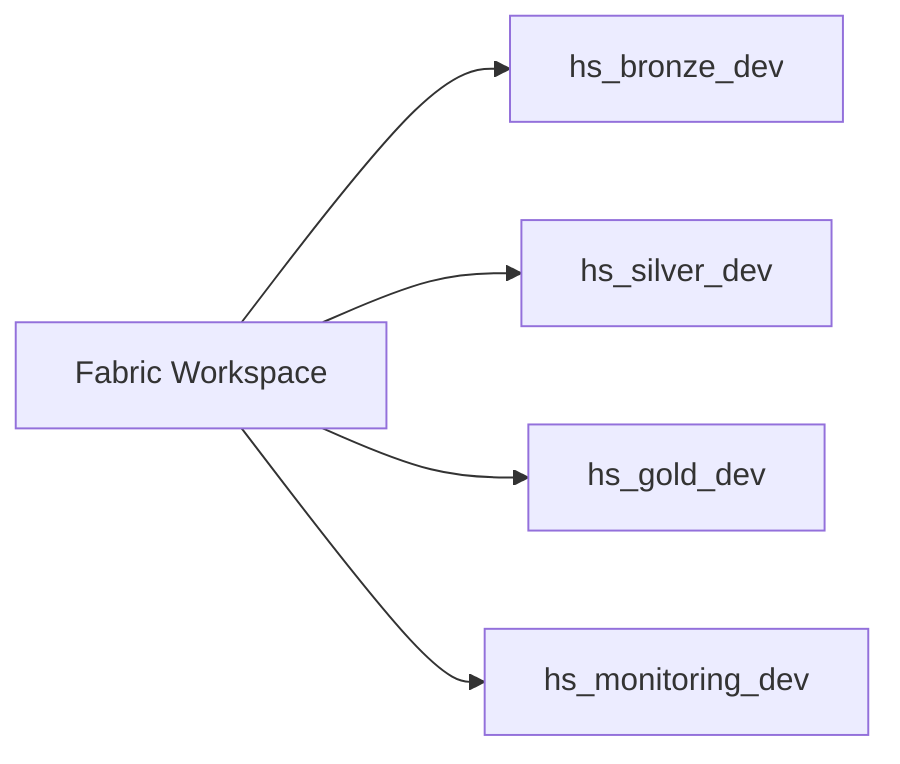

Ich nutze Sequential Thinking für einen pragmatischen Implementierungsplan:# 🎯 MVP Implementierungsplan: Hackerschool Medallion Architecture

## Executive Summary
**Start Small, Scale Fast:** 3 Tables in 2 Wochen → Production-ready mit Monitoring. Focus auf **Quick Wins** statt Perfektionismus.

---

## 📊 Table-Auswahl: Das perfekte MVP-Trio

### Empfohlene 3 Tables (begründet)



| Table | Warum MVP? | Komplexität | Business Value | DQ-Checks |
|-------|-----------|-------------|----------------|-----------|
| **contact** | ✅ Kern-Entity, DQ-kritisch | 🟢 Low | ⭐⭐⭐ | Email, Phone, Namen |
| **account** | ✅ Partner-Analytics, SCD-Kandidat | 🟡 Medium | ⭐⭐⭐ | Partner-Level, Namen |
| **hs_course** | ✅ Hackerschool-Core-Business | 🟡 Medium | ⭐⭐⭐ | Status, Daten |

**Rationale:**
- **contact:** Showcase für DQ (Email/Phone-Regex), einfach zu verstehen
- **account:** Showcase für SCD Type 2 (`hs_partner_level` ändert sich)
- **hs_course:** Showcase für Business Logic (Aggregationen, Status-Historie)

**NICHT im MVP (später):**
- ~~lead~~ (weniger kritisch als contact)
- ~~opportunity~~ (später für Sales-Funnel)
- ~~hs_availability~~ (komplexe Relations)

---

## 🗓️ 2-Wochen-Sprint: Tag-für-Tag-Plan

### **Woche 1: Foundation + First Table (contact)**

#### **Tag 1-2: Setup & Infrastruktur** ⏱️ 4h

**Ziel:** Fabric-Workspace + Lakehouses ready



**Actions:**
1. ✅ **Workspace erstellen:** `hs-fabric-dev` (Fabric UI)
2. ✅ **4 Lakehouses erstellen:** (UI, je 2 Min)
   - `hs_bronze_dev` (Dataverse Link bereits da: hs_shareddev)
   - `hs_silver_dev`
   - `hs_gold_dev`
   - `hs_monitoring_dev` (für Metrics/Logs)
3. ✅ **Git-Sync aktivieren:** Workspace → Settings → Git Integration
4. ✅ **Monitoring-Tables erstellen:** (SQL Endpoint)

**SQL für Monitoring Setup:**
```sql
-- In hs_monitoring_dev
CREATE TABLE pipeline_metrics (
    run_id STRING,
    table_name STRING,
    stage STRING,
    records_in LONG,
    records_out LONG,
    records_failed LONG,
    duration_sec DOUBLE,
    timestamp TIMESTAMP
) USING DELTA;

CREATE TABLE quarantine_records (
    quarantine_id STRING,
    table_name STRING,
    error_type STRING,
    error_message STRING,
    raw_record STRING,
    timestamp TIMESTAMP
) USING DELTA;
```

**Deliverable:** 4 leere Lakehouses + Git-Repo connected

---

#### **Tag 3-4: Bronze → Silver (contact only)** ⏱️ 6h

**Ziel:** Erste DQ-Pipeline läuft

**Notebook 1: `bronze_to_silver_contact.py`** (KISS-Prinzip!)

```python
# NICHT config-driven am Anfang - HARDCODED für Speed!
from pyspark.sql import functions as F
from pyspark.sql.window import Window
import hashlib
from datetime import datetime

# Config (später in Config-Table)
SOURCE_TABLE = "hs_bronze_dev.contact"
TARGET_TABLE = "hs_silver_dev.contact"
RUN_ID = datetime.now().strftime("%Y%m%d_%H%M%S")

# 1. Read Bronze
df_bronze = spark.read.table(SOURCE_TABLE)
print(f"Bronze records: {df_bronze.count()}")

# 2. DQ Checks mit Quarantine
def validate_email(email):
    import re
    if email is None:
        return False
    pattern = r'^[a-zA-Z0-9._%+-]+@[a-zA-Z0-9.-]+\.[a-zA-Z]{2,}$'
    return bool(re.match(pattern, email))

def validate_phone_de(phone):
    import re
    if phone is None:
        return True  # Optional field
    pattern = r'^(\+49|0)[1-9]\d{8,14}$'
    return bool(re.match(pattern, phone))

# Register UDFs
validate_email_udf = F.udf(validate_email)
validate_phone_udf = F.udf(validate_phone_de)

# Apply validations
df_validated = df_bronze.withColumn(
    "_email_valid", validate_email_udf(F.col("emailaddress1"))
).withColumn(
    "_phone_valid", validate_phone_udf(F.col("mobilephone"))
).withColumn(
    "_is_valid", F.col("_email_valid") & F.col("_phone_valid")
)

# 3. Split: Valid vs. Quarantine
df_valid = df_validated.filter(F.col("_is_valid") == True)
df_quarantine = df_validated.filter(F.col("_is_valid") == False)

# 4. Transformations (nur für Valid)
df_silver = df_valid.select(
    F.col("contactid"),
    F.trim(F.col("firstname")).alias("firstname"),
    F.trim(F.col("lastname")).alias("lastname"),
    F.lower(F.trim(F.col("emailaddress1"))).alias("emailaddress1"),
    F.col("mobilephone"),
    F.col("createdon"),
    F.col("modifiedon"),
    F.lit(RUN_ID).alias("_silver_loaded_at")
)

# 5. Deduplication (Latest by modifiedon)
window_spec = Window.partitionBy("contactid").orderBy(F.desc("modifiedon"))
df_silver_dedup = df_silver.withColumn(
    "row_num", F.row_number().over(window_spec)
).filter(F.col("row_num") == 1).drop("row_num")

# 6. Write Silver
df_silver_dedup.write.mode("overwrite").saveAsTable(TARGET_TABLE)

# 7. Write Quarantine
if df_quarantine.count() > 0:
    df_quarantine_log = df_quarantine.select(
        F.expr("uuid()").alias("quarantine_id"),
        F.lit("contact").alias("table_name"),
        F.when(~F.col("_email_valid"), "email_invalid")
         .when(~F.col("_phone_valid"), "phone_invalid")
         .alias("error_type"),
        F.concat_ws("; ",
            F.when(~F.col("_email_valid"), F.lit("Invalid email")),
            F.when(~F.col("_phone_valid"), F.lit("Invalid phone"))
        ).alias("error_message"),
        F.to_json(F.struct("contactid", "emailaddress1", "mobilephone")).alias("raw_record"),
        F.current_timestamp().alias("timestamp")
    )
    df_quarantine_log.write.mode("append").saveAsTable("hs_monitoring_dev.quarantine_records")

# 8. Metrics
records_in = df_bronze.count()
records_out = df_silver_dedup.count()
records_failed = df_quarantine.count()

metrics_df = spark.createDataFrame([{
    "run_id": RUN_ID,
    "table_name": "contact",
    "stage": "bronze_to_silver",
    "records_in": records_in,
    "records_out": records_out,
    "records_failed": records_failed,
    "duration_sec": 0.0,  # TODO: Measure
    "timestamp": datetime.now()
}])
metrics_df.write.mode("append").saveAsTable("hs_monitoring_dev.pipeline_metrics")

print(f"✅ Silver: {records_out} | ❌ Quarantine: {records_failed}")
```

**Deliverable:** 
- ✅ `hs_silver_dev.contact` hat saubere Daten
- ✅ Quarantine hat fehlerhafte Records
- ✅ Metrics erfasst

---

#### **Tag 5-6: Silver → Gold SCD (contact)** ⏱️ 6h

**Notebook 2: `silver_to_gold_scd_contact.py`**

```python
from pyspark.sql import functions as F
from delta.tables import DeltaTable

SOURCE_TABLE = "hs_silver_dev.contact"
TARGET_TABLE = "hs_gold_dev.dim_contact_scd"
BUSINESS_KEY = "contactid"
TRACKED_COLS = ["emailaddress1", "mobilephone", "firstname", "lastname"]

# 1. Read Silver (current snapshot)
df_source = spark.read.table(SOURCE_TABLE).select(
    BUSINESS_KEY,
    *TRACKED_COLS
)

# 2. Calculate Hash
hash_expr = F.md5(F.concat_ws("|", *TRACKED_COLS))
df_source = df_source.withColumn("hash_value", hash_expr) \
    .withColumn("valid_from", F.current_timestamp()) \
    .withColumn("valid_to", F.lit("9999-12-31").cast("timestamp")) \
    .withColumn("is_current", F.lit(True))

# 3. Check if Target exists
if not spark.catalog.tableExists(TARGET_TABLE):
    # Initial Load
    df_source.write.mode("overwrite").saveAsTable(TARGET_TABLE)
    print("✅ Initial SCD load complete")
else:
    # SCD Type 2 MERGE
    delta_target = DeltaTable.forName(spark, TARGET_TABLE)
    
    # MERGE Logic
    delta_target.alias("target").merge(
        df_source.alias("source"),
        f"target.{BUSINESS_KEY} = source.{BUSINESS_KEY} AND target.is_current = TRUE"
    ).whenMatchedUpdate(
        condition = "target.hash_value != source.hash_value",
        set = {
            "is_current": "FALSE",
            "valid_to": "source.valid_from"
        }
    ).execute()
    
    # Insert new versions (for changed rows)
    changed_keys = spark.sql(f"""
        SELECT DISTINCT {BUSINESS_KEY}
        FROM {TARGET_TABLE}
        WHERE valid_to = (SELECT MAX(valid_from) FROM {TARGET_TABLE})
          AND is_current = FALSE
    """)
    
    df_new_versions = df_source.join(
        changed_keys, on=BUSINESS_KEY, how="inner"
    )
    
    # Insert new rows (never existed before)
    existing_keys = spark.sql(f"SELECT DISTINCT {BUSINESS_KEY} FROM {TARGET_TABLE}")
    df_new_rows = df_source.join(
        existing_keys, on=BUSINESS_KEY, how="left_anti"
    )
    
    # Combine and insert
    df_to_insert = df_new_versions.unionByName(df_new_rows)
    if df_to_insert.count() > 0:
        df_to_insert.write.mode("append").saveAsTable(TARGET_TABLE)
    
    print(f"✅ SCD updates: {df_new_versions.count()} changes, {df_new_rows.count()} new")
```

**Deliverable:**
- ✅ `hs_gold_dev.dim_contact_scd` hat historisierte Daten
- ✅ SCD Type 2 funktioniert

---

#### **Tag 7: Quick Monitoring Dashboard** ⏱️ 3h

**Power BI Report: "Medallion Health"**

**Query 1: Pipeline Overview**
```sql
SELECT 
    DATE(timestamp) as run_date,
    table_name,
    stage,
    SUM(records_in) as total_in,
    SUM(records_out) as total_out,
    SUM(records_failed) as total_failed,
    ROUND(AVG(duration_sec), 2) as avg_duration_sec
FROM hs_monitoring_dev.pipeline_metrics
WHERE timestamp >= CURRENT_DATE() - INTERVAL 7 DAYS
GROUP BY DATE(timestamp), table_name, stage
ORDER BY run_date DESC, table_name;
```

**Query 2: Error Rate Trend**
```sql
SELECT 
    DATE(timestamp) as error_date,
    error_type,
    COUNT(*) as error_count
FROM hs_monitoring_dev.quarantine_records
WHERE timestamp >= CURRENT_DATE() - INTERVAL 7 DAYS
GROUP BY DATE(timestamp), error_type
ORDER BY error_date DESC;
```

**Deliverable:** Power BI mit 2 Charts (Funnel + Error-Trend)

---

### **Woche 2: Scale Pattern + Automation**

#### **Tag 8-9: Replicate Pattern (account, hs_course)** ⏱️ 8h

**Strategy:** Copy-Paste-Modify Ansatz (schnell!)

1. **account:**
   - Copy `bronze_to_silver_contact.py` → `bronze_to_silver_account.py`
   - Modify: DQ-Checks für `name` (NOT NULL), `hs_partner_level` (Enum)
   - SCD: Track `hs_partner_level` changes

2. **hs_course:**
   - Copy Pattern
   - DQ: `startdate < enddate`, Status-Validierung
   - NO SCD (erstmal), nur Clean-Layer

**Deliverable:** 3 Tables in Silver + 2 in Gold (contact, account)

---

#### **Tag 10: Orchestration (Simple Pipeline)** ⏱️ 4h

**Fabric Pipeline: `medallion_orchestrator`**

```
Pipeline Activities:
1. Notebook: bronze_to_silver_contact
2. Notebook: bronze_to_silver_account  
3. Notebook: bronze_to_silver_hs_course
4. Notebook: silver_to_gold_scd_contact
5. Notebook: silver_to_gold_scd_account
```

**Schedule:** Täglich um 2:00 AM

**Deliverable:** Automated Daily Run

---

#### **Tag 11-12: Config-Driven (Optional, wenn Zeit)** ⏱️ 6h

**Refactoring zu Config-Table:**

```sql
CREATE TABLE hs_silver_dev.transformation_config (
    table_name STRING,
    dq_rules STRING,  -- JSON
    scd_enabled BOOLEAN,
    scd_tracked_cols STRING,  -- JSON Array
    active BOOLEAN
);

INSERT INTO hs_silver_dev.transformation_config VALUES
('contact', '{"email_field":"emailaddress1","phone_field":"mobilephone"}', true, '["emailaddress1","mobilephone"]', true),
('account', '{"name_field":"name"}', true, '["hs_partner_level"]', true),
('hs_course', '{}', false, '[]', true);
```

**Generic Notebook:** Liest Config → Dynamisch

**Deliverable:** 1 Notebook ersetzt 3 (skaliert auf 50 Tables)

---

#### **Tag 13: Testing & Documentation** ⏱️ 4h

**Testing:**
1. ✅ Insert Test-Data in Bronze
2. ✅ Run Pipeline manually
3. ✅ Validate Silver (DQ passed?)
4. ✅ Validate Gold (SCD working?)
5. ✅ Check Monitoring (Metrics korrekt?)

**Documentation:**
- README.md im Git
- Runbook für Ops-Team
- Troubleshooting-Guide

---

#### **Tag 14: Stakeholder Demo** ⏱️ 2h

**Demo-Script:**
1. Show Bronze (Raw Dataverse)
2. Show Silver (Clean + Quarantine)
3. Show Gold (SCD-Historie)
4. Show Dashboard (Monitoring)
5. Demo: Add new table in 15 Min (config-driven)

---

## 🚀 Quick Start: Heute loslegen (1 Stunde)

### Option A: Fabric UI (Recommended)

```bash
# 1. Browser → https://app.fabric.microsoft.com
# 2. Workspace erstellen: "hs-fabric-dev"
# 3. Lakehouses erstellen (4x klicken):
#    - hs_bronze_dev (skip, already exists as hs_shareddev)
#    - hs_silver_dev
#    - hs_gold_dev
#    - hs_monitoring_dev
# 4. Notebook erstellen: "bronze_to_silver_contact"
# 5. Copy-Paste Code von oben
# 6. Run!
```

### Option B: Fabric REST API (Advanced)

```bash
# Setup
pip install azure-identity requests

# Python Script: create_lakehouses.py
from azure.identity import DefaultAzureCredential
import requests

credential = DefaultAzureCredential()
token = credential.get_token("https://analysis.windows.net/powerbi/api/.default").token

workspace_id = "YOUR_WORKSPACE_ID"
headers = {"Authorization": f"Bearer {token}"}

for lh_name in ["hs_silver_dev", "hs_gold_dev", "hs_monitoring_dev"]:
    response = requests.post(
        f"https://api.fabric.microsoft.com/v1/workspaces/{workspace_id}/lakehouses",
        headers=headers,
        json={"displayName": lh_name}
    )
    print(f"Created: {lh_name}")
```

---

## 📋 Deliverables-Checkliste

| Deliverable | Owner | Status | ETA |
|-------------|-------|--------|-----|
| 4 Lakehouses setup | Stefan | 🟢 Ready | Tag 1 |
| Monitoring Tables | Stefan | ⚪ Todo | Tag 2 |
| contact Bronze→Silver | Saber | ⚪ Todo | Tag 4 |
| contact Silver→Gold SCD | Stefan | ⚪ Todo | Tag 6 |
| Power BI Dashboard | Stefan | ⚪ Todo | Tag 7 |
| account/hs_course Replicate | Saber | ⚪ Todo | Tag 9 |
| Pipeline Orchestration | Stefan | ⚪ Todo | Tag 10 |
| Testing | Both | ⚪ Todo | Tag 13 |
| Stakeholder Demo | Stefan | ⚪ Todo | Tag 14 |

---

## 🎯 Success Criteria

**Week 1 Done when:**
- ✅ 1 Table (contact) vollständig durch Medallion
- ✅ DQ-Checks funktionieren (Email/Phone)
- ✅ SCD Type 2 trackt Email-Änderungen
- ✅ Monitoring zeigt Metrics

**Week 2 Done when:**
- ✅ 3 Tables (contact, account, hs_course) in Silver
- ✅ 2 Tables (contact, account) in Gold mit SCD
- ✅ Daily Pipeline läuft automatisch
- ✅ Power BI Dashboard live

---

## 💡 Pro-Tipps für Speed

1. **Don't over-engineer:** Start hardcoded, refactor later
2. **Copy-Paste ist OK:** Pattern funktioniert? Repliziere es!
3. **Fabric UI > CLI:** Am Anfang für Learning
4. **Monitor early:** Metrics von Tag 1 an
5. **Demo-driven:** Jede Woche was zeigbares

---

**Soll ich dir jetzt:**
1. ✅ **Den kompletten Code für Tag 3-4 generieren?** (alle 2 Notebooks)
2. ✅ **SQL-Scripts für Monitoring-Setup?**
3. ✅ **Power BI Queries fertig machen?**

Oder erstmal mit **Schritt 1 (Setup) loslegen** und ich guide dich durch?
